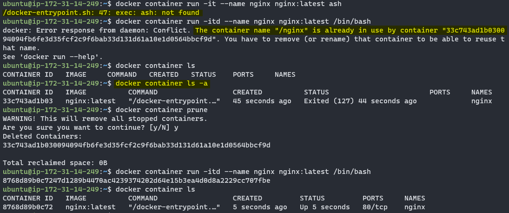

# Docker常用指令

## 啟動容器
`docker container run -itd --name <name> <image> <command>`

-i: 可進入互動式操作
-t: 終端
-d: 背景執行，預設不會立刻進入容器

e.g.
`docker container run -it alpine ash`
`docker container run -d --name nginx nginx:latest /bin/bash`

容器建立過程中有錯誤也有可能會建立成功但不會執行，需檢查是否出現在未執行的容器列表中

## 進入容器
`docker container exec -it <container id or name> <shell>`

## 容器在宿主機的輸出路徑
`/var/lib/docker/containers/容器ID`

## 看nginx log
1. 到輸出路徑看
2. 到容器內的 `/var/log/nginx/` 看
3. `docker logs -n 50 -f nginx`

## Nginx
nginx檔案位置
`/opt/nginx/volumes/nginx/conf.d`

檢查語法
`docker exec nginx nginx -t`

重啟nginx
`docker exec nginx nginx -s reload`

## 重啟容器
`docker restart <容器ID>`

## 清除不用的image
`docker image prune`

https://blog.miniasp.com/post/2022/11/18/docker-image-prune-notes