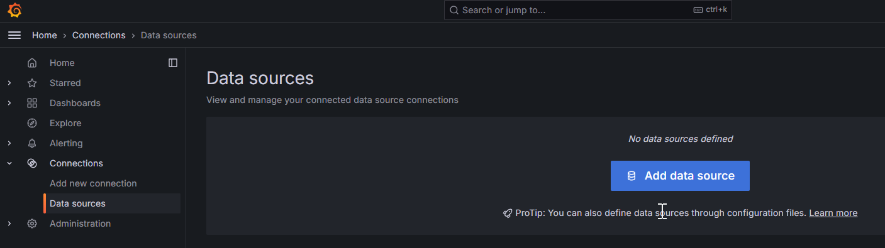
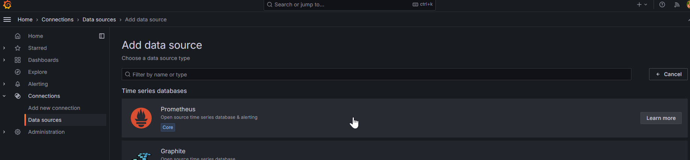
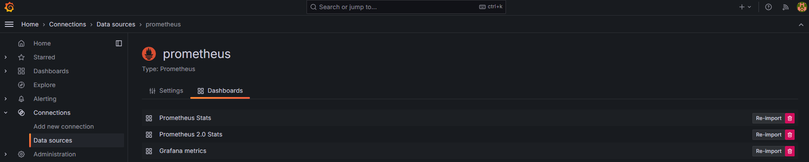
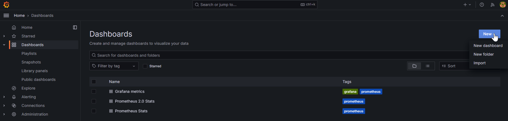
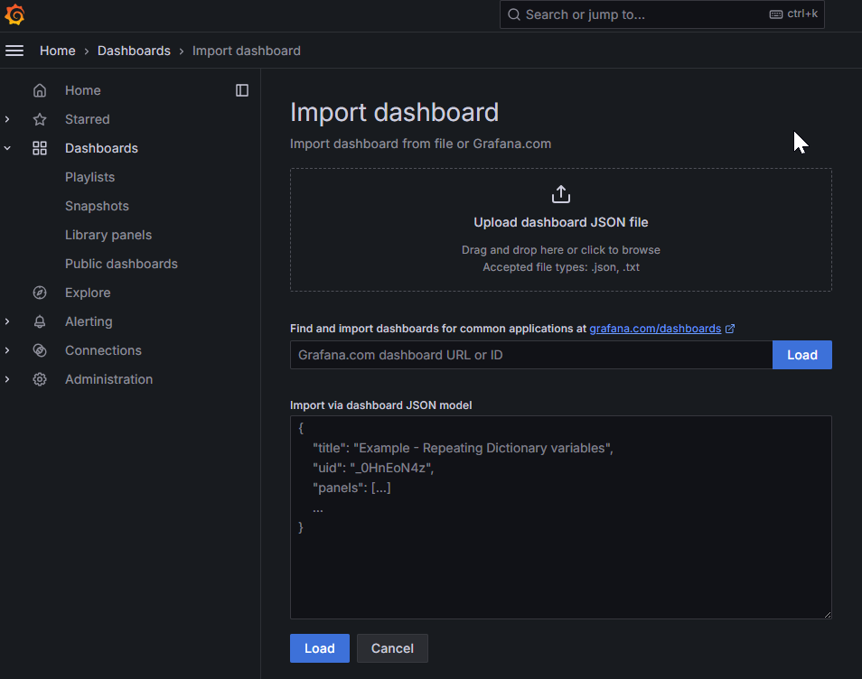
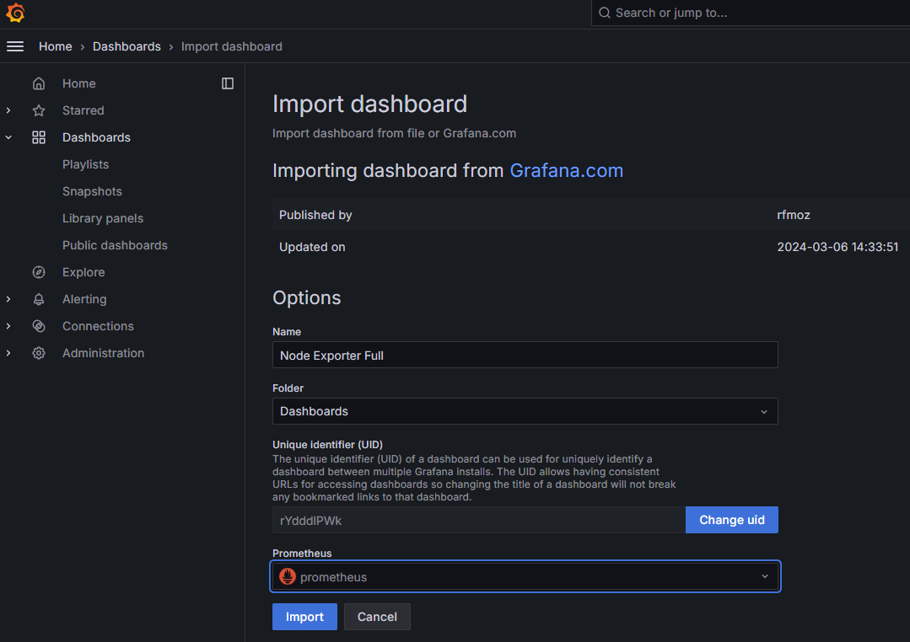

# Install Prometheus Server on CentOS 7 / RHEL 7 local machine
>reference:
>
>https://computingforgeeks.com/install-prometheus-server-on-centos-rhel/  
>https://www.howtoforge.com/tutorial/how-to-install-prometheus-and-node-exporter-on-centos-7/  
>https://www.howtoforge.com/tutorial/how-to-install-prometheus-and-node-exporter-on-centos-7/#step-install-and-configure-nodeexporter  
>https://centlinux.com/install-prometheus-on-centos-7/  
>https://centlinux.com/install-grafana-on-centos-7/  
>https://technixleo.com/install-grafana-with-prometheus-on-rhel-centos-stream/  
>https://grafana.com/grafana/dashboards/1860-node-exporter-full/  

>prometheus.io download link (Prometheus and node_exporter):
>
>https://prometheus.io/download/

In this document, we will install Prometheus, node exporter, and Grafana in sequence.
There are steps below.

## What will we do
- [Install Prometheus](#prometheus)
    1. [Create new group, user and directories for Prometheus](#1-create-new-group-user-and-directories-for-prometheus)
    2. [Download and Install Prometheus](#2-download-and-install-prometheus)
    3. [Create Prometheus systemd unit file](#3-create-prometheus-systemd-unit-file)

- [Install node_exporter](#node_exporter)
    1. [Create directories for node_exporter](#1-create-directories-for-node_exporter)
    2. [Download node_exporter and install it](#2-download-node_exporter-and-install-it)
    3. [Configure node_exporter as a systemd service](#3-configure-node_exporter-as-a-systemd-service)
    4. [Add node_exporter to the Prometheus Server](#4-add-node_exporter-to-the-prometheus-server)

- [Install Grafana](#grafana)
    1. [Add Grafana official repository](#1-add-grafana-official-repository)
    2. [Install Grafana with yum](#2-install-grafana-with-yum)
    3. [Import Prometheus data source and build dashboard](#3-import-prometheus-data-source-and-build-dashboard)

## Steps

### Prometheus

#### 1. Create new group, user and directories for Prometheus

```
sudo groupadd --system prometheus

sudo useradd -s /sbin/nologin --system -g prometheus prometheus

sudo mkdir /var/lib/prometheus

for i in rules rules.d files_sd; do sudo mkdir -p /etc/prometheus/${i}; done
```

#### 2. Download and Install Prometheus

```
mkdir -p /tmp/prometheus && cd /tmp/prometheus

curl -s https://api.github.com/repos/prometheus/prometheus/releases/latest \
  | grep browser_download_url \
  | grep linux-amd64 \
  | cut -d '"' -f 4 \
  | wget -qi -

tar xvf prometheus*.tar.gz

cd prometheus*/

> # Move files
sudo mv prometheus promtool /usr/local/bin/

sudo mv prometheus.yml  /etc/prometheus/prometheus.yml

sudo mv consoles/ console_libraries/ /etc/prometheus/

cd ~/

rm -rf /tmp/prometheus

> # Set permissions
for i in rules rules.d files_sd; do sudo chown -R prometheus:prometheus /etc/prometheus/${i}; done

for i in rules rules.d files_sd; do sudo chmod -R 775 /etc/prometheus/${i}; done

sudo chown -R prometheus:prometheus /var/lib/prometheus/

> # Edit a Prometheus configuration file if need
sudo vim /etc/prometheus/prometheus.yml
```
prometheus.yml will looks like:
```
# my global config
global:
  scrape_interval:     15s # Set the scrape interval to every 15 seconds. Default is every 1 minute.
  evaluation_interval: 15s # Evaluate rules every 15 seconds. The default is every 1 minute.
  # scrape_timeout is set to the global default (10s).

# Alertmanager configuration
alerting:
  alertmanagers:
  - static_configs:
    - targets:
      # - alertmanager:9093

# Load rules once and periodically evaluate them according to the global 'evaluation_interval'.
rule_files:
  # - "first_rules.yml"
  # - "second_rules.yml"

# A scrape configuration containing exactly one endpoint to scrape:
# Here it's Prometheus itself.
scrape_configs:
  # The job name is added as a label `job=<job_name>` to any timeseries scraped from this config.
  - job_name: 'prometheus'

    # metrics_path defaults to '/metrics'
    # scheme defaults to 'http'.

    static_configs:
    - targets: ['localhost:9090']
```

#### 3. Create Prometheus systemd unit file

Create file with `sudo vim /etc/systemd/system/prometheus.service` then edit file like this:
```
[Unit]
Description=Prometheus
Documentation=https://prometheus.io/docs/introduction/overview/
Wants=network-online.target
After=network-online.target

[Service]
Type=simple
Environment="GOMAXPROCS=<fill a number of vcpus on the server>"
User=prometheus
Group=prometheus
ExecReload=/bin/kill -HUP $MAINPID
ExecStart=/usr/local/bin/prometheus \
  --config.file=/etc/prometheus/prometheus.yml \
  --storage.tsdb.path=/var/lib/prometheus \
  --web.console.templates=/etc/prometheus/consoles \
  --web.console.libraries=/etc/prometheus/console_libraries \
  --web.listen-address=0.0.0.0:9090 \
  --web.external-url=

SyslogIdentifier=prometheus
Restart=always

[Install]
WantedBy=multi-user.target
```

After then, reload daemon and start Prometheus
```
sudo systemctl daemon-reload

sudo systemctl start prometheus

sudo systemctl enable prometheus

systemctl status prometheus
```

Open Prometheus server port and reload firewall

```
sudo firewall-cmd --permanent --add-rich-rule 'rule family="ipv4" source address="<your IP>" port protocol="tcp" port="9090" accept'

sudo firewall-cmd --reload
```

Finished installing Prometheus, please check firewall of the server and connect to `http://localhost:9090` to see if Prometheus works well.

### node_exporter

#### 1. Create directories for node_exporter

```
sudo mkdir /etc/node_exporter

sudo mkdir -p /tmp/node_exporter && cd /tmp/node_exporter
```

#### 2. Download node_exporter and install it

```
> # Change version to what you want
wget https://github.com/prometheus/node_exporter/releases/download/v1.7.0/node_exporter-1.7.0.linux-amd64.tar.gz

tar xvf node_exporter*.tar.gz

cd node_exporter*/

sudo mv node_exporter /etc/node_exporter/node_exporter

> # Set permissions for Prometheus; If the node_exporter is installed on different machine, it will need to create new group and user for Prometheus
sudo chown -R prometheus:prometheus /etc/node_exporter
```

#### 3. Configure node_exporter as a systemd service

Create file with `sudo vim /etc/systemd/system/node_exporter.service` witch contains below:

```
[Unit]
Description=Node Exporter
Wants=network-online.target
After=network-online.target

[Service]
Type=simple
User=prometheus
Group=prometheus
ExecStart=/etc/node_exporter/node_exporter
ExecReload=/bin/kill -HUP $MAINPID
Restart=on-failure
RestartSec=5s

[Install]
WantedBy=default.target
```

Then reload daemon and start Prometheus
```
sudo systemctl daemon-reload

sudo systemctl start node_exporter

sudo systemctl enable node_exporter

systemctl status node_exporter
```


Open node_exporter port and reload firewall


```
sudo firewall-cmd --permanent --add-rich-rule 'rule family="ipv4" source address="<your IP>" port protocol="tcp" port="9100" accept'

sudo firewall-cmd --reload

```
For checking node_exporter, connect to `http://localhost:9100`, `http://localhost:9100/metrics` to see if there has metrics information.

#### 4. Add node_exporter to the Prometheus Server

```
sudo vim /etc/prometheus/prometheus.yml
```

Add node_exporter targets into the `prometheus.yml`

```
  - job_name: "node"

    static_configs:
      - targets: ["localhost:9100"]
```

All of theme will be looked like:

```
# my global config
global:
  scrape_interval: 15s # Set the scrape interval to every 15 seconds. Default is every 1 minute.
  evaluation_interval: 15s # Evaluate rules every 15 seconds. The default is every 1 minute.
  # scrape_timeout is set to the global default (10s).

# Alertmanager configuration
alerting:
  alertmanagers:
    - static_configs:
        - targets:
          # - alertmanager:9093

# Load rules once and periodically evaluate them according to the global 'evaluation_interval'.
rule_files:
  # - "first_rules.yml"
  # - "second_rules.yml"

# A scrape configuration containing exactly one endpoint to scrape:
# Here it's Prometheus itself.
scrape_configs:
  # The job name is added as a label `job=<job_name>` to any timeseries scraped from this config.
  - job_name: "prometheus"

    # metrics_path defaults to '/metrics'
    # scheme defaults to 'http'.

    static_configs:
      - targets: ["localhost:9090"]

  - job_name: "node"

    static_configs:
      # If need to add more, just add in targets array, like ["localhost:9100", "<other node IP here>:9100"]
      - targets: ["localhost:9100"]
```

Then restart Prometheus

```
systemctl restart prometheus
```

### Grafana

#### 1. Add Grafana official repository

```
sudo vim /etc/yum.repos.d/grafana.repo
```

Edit this new file with below:

```
[grafana]
name=grafana
baseurl=https://packages.grafana.com/oss/rpm
repo_gpgcheck=1
enabled=1
gpgcheck=1
gpgkey=https://packages.grafana.com/gpg.key
sslverify=1
sslcacert=/etc/pki/tls/certs/ca-bundle.crt
```

Build yum cache

```
sudo yum makecache fast
```

#### 2. Install Grafana with yum

```
sudo yum install grafana -y

systemctl enable --now grafana-server.service
```
Command `systemctl enable --now grafana-server.service` will help to Create symlink from `/etc/systemd/system/multi-user.target.wants/grafana-server.service` to `/usr/lib/systemd/system/grafana-server.service`.

Open Grafana server port and reload firewall

```
sudo firewall-cmd --permanent --add-rich-rule 'rule family="ipv4" source address="<your IP>" port protocol="tcp" port="3000" accept'

sudo firewall-cmd --reload
```

Installing finished! Check `http://localhost:3000` to see Grafana login page.

#### 3. Import Prometheus data source and build dashboard

Login Grafana at `http://localhost:3000` , default account/password is `admin/admin`

Add Prometheus data source.



And there are some default dashboards can be imported.


Import other dashboard




### Others

Install Prometheus and node_exporter with docker-compose:  
https://grafana.com/docs/grafana-cloud/send-data/metrics/metrics-prometheus/prometheus-config-examples/docker-compose-linux/  
