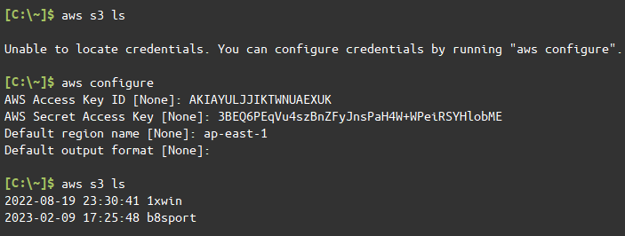

# S3上傳圖片

透過aws cli放到S3上
第一次操作的時候要設定存取憑證

https://docs.aws.amazon.com/zh_tw/cli/latest/userguide/cli-services-s3-commands.html

上傳物件範例
`aws s3 cp mw s3://b8sport/icon/mw --recursive --region ap-east-1 --profile guojipan99@gmail.com`

`--recursive` ：遞迴，上傳路徑下所有物件
`--region` ：預設都是ap-east-1
