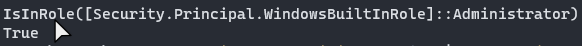
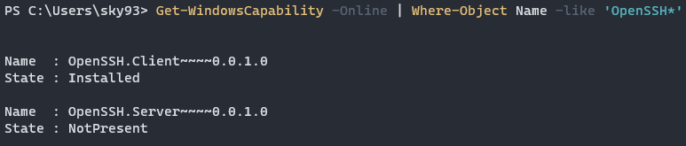
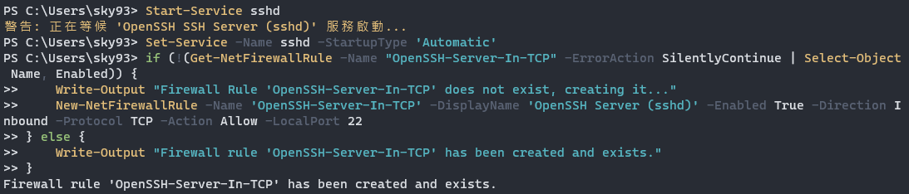
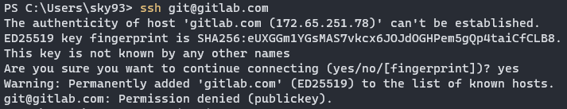
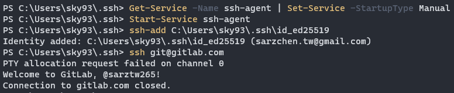

# SSH key無法連線GitLab

參考資料：
https://stackoverflow.com/questions/40427498/getting-permission-denied-public-key-on-gitlab

https://learn.microsoft.com/zh-tw/windows-server/administration/openssh/openssh_install_firstuse?tabs=powershell

https://learn.microsoft.com/zh-tw/windows-server/administration/openssh/openssh_keymanagement

配置的金鑰權限正確，但是無法連線到gitlab，透過指令 `ssh -vvvv git@gitlab.com` 檢查

```
$ ssh -vvvv git@gitlab.com
OpenSSH_for_Windows_8.6p1, LibreSSL 3.4.3
debug1: Reading configuration data C:\\Users\\sky93/.ssh/config
debug3: Failed to open file:C:/ProgramData/ssh/ssh_config error:2
debug3: expanded UserKnownHostsFile '~/.ssh/known_hosts' -> 'C:\\Users\\sky93/.ssh/known_hosts'
debug3: expanded UserKnownHostsFile '~/.ssh/known_hosts2' -> 'C:\\Users\\sky93/.ssh/known_hosts2'
debug1: Authenticator provider $SSH_SK_PROVIDER did not resolve; disabling
.
.
.
debug2: we did not send a packet, disable method
debug1: No more authentication methods to try.
git@gitlab.com: Permission denied (publickey).
```

從log中發現系統並沒有找到 `.ssh` 路徑和其底下的key，可能是windows的OpenSSH沒有設置完整

## 安裝OpenSSH
以管理員身分開啟PowerShell，確認自己有在管理員群組內，有的話會回傳True
```
(New-Object Security.Principal.WindowsPrincipal([Security.Principal.WindowsIdentity]::GetCurrent())).IsInRole([Security.Principal.WindowsBuiltInRole]::Administrator)
```


接著確認是否已經安裝過OpenSSH的client和server
```
Get-WindowsCapability -Online | Where-Object Name -like 'OpenSSH*'
```


依據需要安裝尚未安裝(NotPresent)的部分
```
# Install the OpenSSH Client
Add-WindowsCapability -Online -Name OpenSSH.Client~~~~0.0.1.0

# Install the OpenSSH Server
Add-WindowsCapability -Online -Name OpenSSH.Server~~~~0.0.1.0
```

安裝成功後會顯示以下輸出
```
Path          :
Online        : True
RestartNeeded : False
```

接著啟動 `sshd`
```
# Start the sshd service
Start-Service sshd

# OPTIONAL but recommended:
Set-Service -Name sshd -StartupType 'Automatic'

# Confirm the Firewall rule is configured. It should be created automatically by setup. Run the following to verify
if (!(Get-NetFirewallRule -Name "OpenSSH-Server-In-TCP" -ErrorAction SilentlyContinue | Select-Object Name, Enabled)) {
    Write-Output "Firewall Rule 'OpenSSH-Server-In-TCP' does not exist, creating it..."
    New-NetFirewallRule -Name 'OpenSSH-Server-In-TCP' -DisplayName 'OpenSSH Server (sshd)' -Enabled True -Direction Inbound -Protocol TCP -Action Allow -LocalPort 22
} else {
    Write-Output "Firewall rule 'OpenSSH-Server-In-TCP' has been created and exists."
}
```


測試ssh連線
`ssh domain\username@servername`


到這步還是可能出現錯誤訊息(Permission denied)，可以嘗試將金鑰加入ssh-agent

## 將金鑰加入ssh-agent
```
# By default the ssh-agent service is disabled. Configure it to start automatically.
# Make sure you're running as an Administrator.
Get-Service ssh-agent | Set-Service -StartupType Automatic

# Start the service
Start-Service ssh-agent

# This should return a status of Running
Get-Service ssh-agent

# Now load your key files into ssh-agent
ssh-add $env:USERPROFILE\.ssh\id_ed25519
```


此時再次測試 `ssh domain\username@servername` 應該就能成功連上了