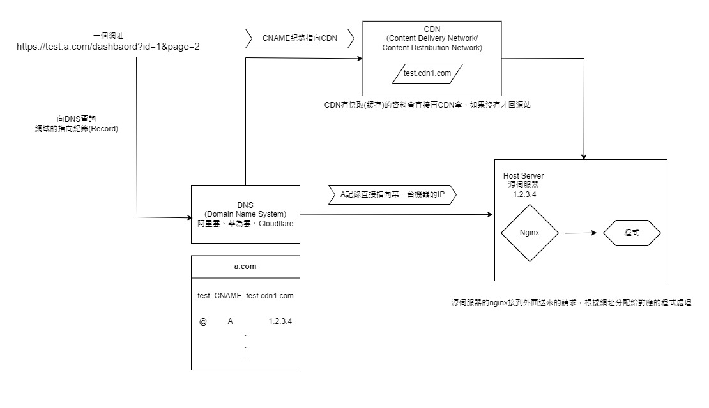

# CDN和DNS

在瀏覽器的網址列打完網址然後按enter這個動作，對電腦來說叫做「發送請求」，請求送出去之後會先到DNS看這個網址對應到哪台機器

DNS上會有這個網址中「域名」部分的紀錄，之前說的CNAME和A指向是紀錄的其中兩種，也是實務操作上最常見的

我們平常的工作最常見的是CNAME指向，意思是這個網址指向到另一個網址(通常是CDN廠商的)，所以我們在追這條網址的線路的時候，要知道他是掛在哪個CDN底下的，就必須先找出這個網址的CNAME指向哪裡

當請求沿著CNAME到了CDN之後，CDN會先看請求要的東西自己有沒有，如果有就會直接給發請求的人，不用再繼續往後走：如果沒有，CDN就會把請求送到源伺服器處理，通常就是我們的機器

另一種紀錄叫做A指向，就是域名是直接指到一台伺服器的IP(192.168.50.1這種格式)，大部分情況下這個IP就是處理請求的機器了