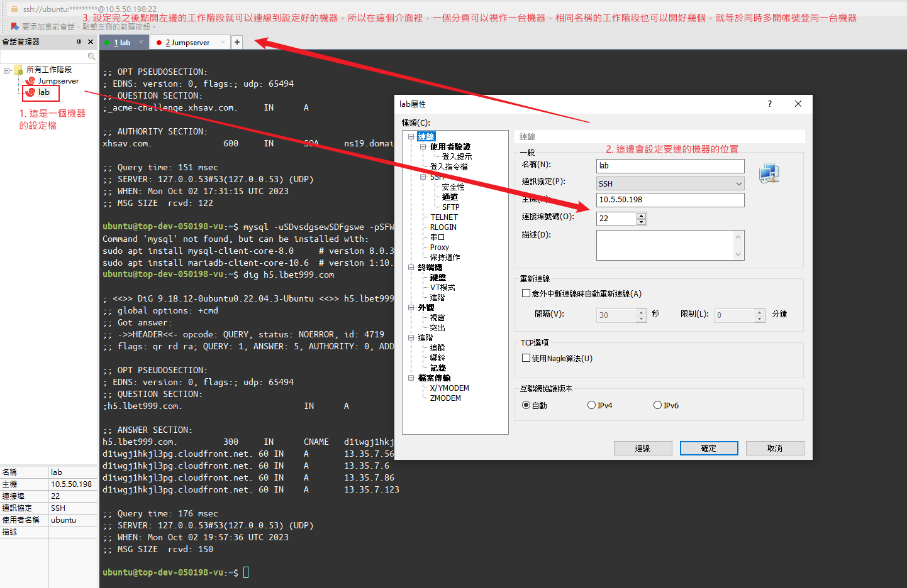

# IP和域名

在網路上要找到一台機器的位置可以透過IP地址(Internet Protocol Address)或域名(Domain Name)來辨識，這兩個對電腦來說都是一種目的地，只是IP有點像地址 e.g. 台北市士林區前港街11號，而域名比較像大樓或店家的名子 e.g. 路易莎士林前港門市

常見的IP有兩大類，第一種也是最常用的是IPv4，格式是四組0~255之間的數字中間用小數點隔開，例如 172.16.254.1；第二種叫IPv6，可以用的IP總數比IPv4多，格式是八組十六進位的數字中間用小數點隔開，如 2001:db8:0:1234:0:567:8:1 ，個人體感比較常在手機上看到

而因為IP的數字對人類來說不好看也不好記，所以有了域名和DNS這兩個東西，域名對人類來說是比較有意義的一串英數字 e.g. aaa.com ，而DNS和NS(Name Server)負責記錄這個域名配對的IP或其他域名是什麼，當有人問說：哈囉請問aaa.com怎麼走，DNS就會查詢這個域名記錄在哪個NS，假設在阿里雲，這時候就可以向阿里雲的NS進一步詢問aaa.com指向哪個IP或域名，一路找到真正的機器位置