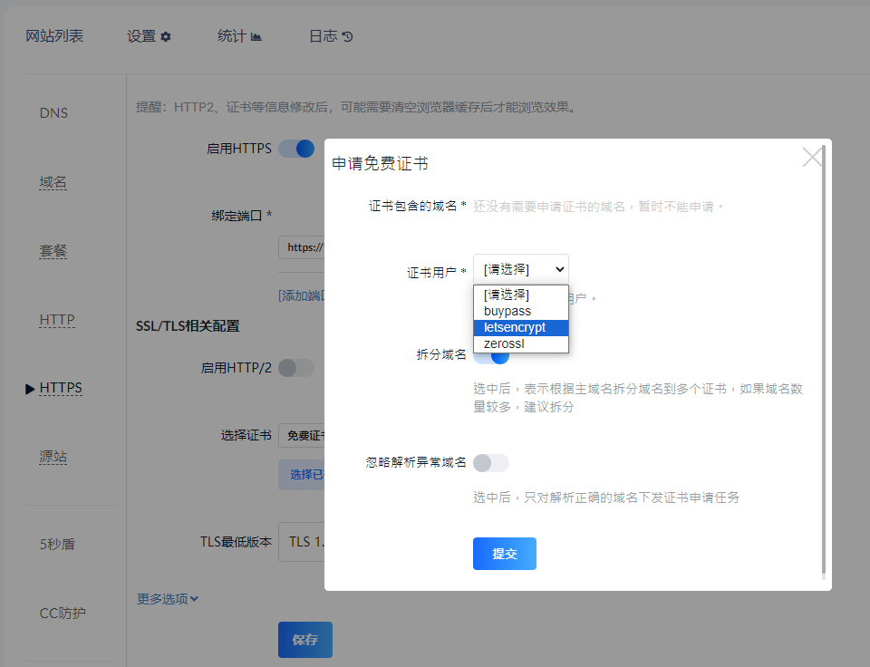

# 憑證

網域在用的「證書」或「憑證」指的是SSL憑證(Secure Sockets Layer Certificate)，是讓http受到保護變成https的證明；一條網域剛設定好的時候只能走http的80 port，必須在伺服器加上證書才能走https的443 port

SSL證書是由一些憑證頒發機構(CA/Certificate Authority)驗證過網域的擁有者身分、公司名稱等等資料後簽發的，會驗證的多詳細要看申請的證書等級，我們平常在用的通常是DV (Domain Validation)等級，只會驗證網域的擁有者是誰，其他還有會驗證所屬機關或公司團體的OV (Organization Validation)等級，和審核項目更多、同時是最高的EV (Extension Validation)等級；依照證書的等級會需要付費，通常DV等級會有免費證書可以使用

免費證書大多是透過Let's Encrypt這個CA頒發的，特點是免費和自動化，申請快速不用等待任何人工審核，像是我們的自建CDN上就是使用Let's Encryptx來申請證書

除了需要找第三方CA產生的證書，也有讓使用者可以自行驗證的自簽證書(Self-Signed CA)，例如可以透過OpenSSL這個工具產生免費的證書

另外憑證是有效期的，免費證書常見的效期是三個月，付費證書的效期可以以年為單位起算；證書如果到期要再換新的，所以CDN上常常會看到自動續期的功能避免https失效