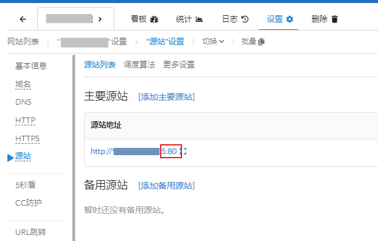

# 源站的port

port是通訊埠，又叫連接埠，中國翻譯成端口，是指請求送到伺服器時接收的窗口，在網址上表示成 主域名或IP:數字 e.g. http://test.com:8080 ，當主域名後面沒有冒號和指定的埠號的時候，預設http是80，https是443

不同類型的請求會從不同的通訊埠進到伺服器，可以想成銀行的業務窗口，像是證券開戶要到一號櫃台，儲蓄業務要到二號櫃台等等，常見的請求例如http是走到80 port，https走443 port，遠端ssh連線走22 port等等；什麼協議(請求的類型)走哪個port是那個協議一開始設計時就規定好的，自己換就可能會不通

在設定CDN時會遇到設定「回源」，這時要確認源站(伺服器)開放的通訊埠(端口)是哪個

